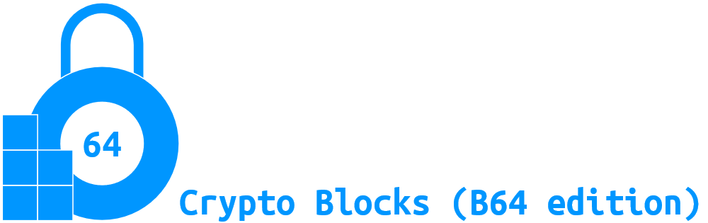

# 
Crypto Blocks is a simple package that consists of various fundamental functions for building cryptogaphic algorithms.

### It provides:

1. Various general functions required for creating your own Cryptographic algorithm.
2. Functions are Classified into classes for ease of use.
3. instead of operating on a single bit this edition works in B64 style (instead of {0 or 1} its **{0,....,63}** values per element)
4. Provides easy encoding conversion,S&P Box generation,and many more functions

